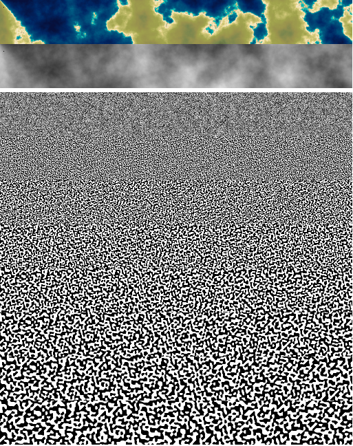

# noiseproto

Logic, data structures, and rendering functions for experimenting with 2D procedurally generated shapes and patterns.

mostly a fork of https://github.com/timetocode/volcanic-island-generator

This is not a library intended for consumption by another program. This is just something you fork/download and play with.

## PRNG

`MersenneTwister` - a seedable pseudo random generator, see https://github.com/boo1ean/mersenne-twister

`SimplexNoise` - a simplex noise generator, can be configured to use a PRNG or use Math.random, see https://github.com/jwagner/simplex-noise.js

`Grid` - a two dimensional grid of values, initialize with `new Grid(width, height)` and then mutate or query data with `grid.set(x, y newValue)` or `grid.get(x, y)`.

## Generators
There are two functions that fill a grid with data.

`clouds(simplex, grid)`- the classic organic noise cloudy pattern

`octave(simplex, grid)` - a single octave (like a layer) of the clouds pattern. This is basically plain simplex noise as varying resolutions.

## Rendering
These functions render at 0, 0 by default, or at x, y if the last two arguments are supplied.

`renderGradient(context, grid, theme, x, y)` - renders values with a colorized gradient

`renderGrayscale(context, grid, x, y)` - renders values in grayscale

## Example and discussion

`npm start`
Open your browser to http://localhost:1234 and you'll see the following:

What is the meaning of these horizontal strips of color and texture? Well, from top to bottom:

* a strip of ocean and land, made by colorizing values from a heightmap
* the raw heightmap data drawn in grayscale (-1.0 would be black, 1.0 would be white), also named `clouds` in the code
* 8 octaves of simplex noise that together commbine and create the `clouds` heightmap

It may seem strange that a pattern that looks essentially like TV static can somehow turn into continents/islands/heightmaps. 

## Going further
Create new generators! Make different maps, or make textures like wood, fire, marble.

Add new color themes.

Mix (mathematically average or weigh) the combination of predefined shapes and noise. The volcanic island generator was the averaging of a heightmap and a radial gradient.

Render multiple layers over one another (will have to make the top layers partially transparent). Add a city or forest over a landmass.

Create a ""heightmap"" and use it as a mask that mixes two other maps together (this is kinda how biomes work in many procedurally generated games).

Create multiple grids of data e.g. height, rainfall, temperature, and then write a function that classifies areas of the game as biomes per the relationships of those three values (wet, above sea level, hot? -> tropical rainforest).

Scrap the renderer and use the underlying data to make tiles for a tile-based game.